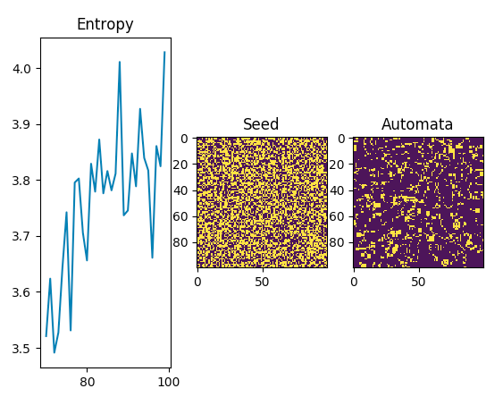

# Celluar Automata Simulator



Run, evaluate and plot cellular automata simulations from a simple command line interface.

## Installation

Using pipenv, install and then load the shell

```
pipenv install
```

## Usage

```
usage: cli.py [-h] [--thresholds T T T T] [--universe-size U U]
              [--neighborhood-size N N] [--steps S] [--should-animate A]

Run a cellular automata simulation.

optional arguments:
  -h, --help            show this help message and exit
  --thresholds T T T T  Thresholds for kernel function. (default: (1.9, 2.1,
                        2.9, 3.1))
  --universe-size U U   Universe size (x,y) (default: (100, 100))
  --neighborhood-size N N
                        Kernel neighborhood size (x,y) (default: (3, 3))
  --steps S             Number of steps to run simulation (default: 100)
  --should-animate A    Enable matplot lib animation. (default: False)
```

## Example

Run Conway's Game of Life for 200 steps:

```
python cli.py --steps=200
```

## Persisting Results

### Saving

```
python cli.py --neighborhood-size 3 3 --save-to=examples/gol01/gol_ca
```

### Loading

```
python cli.py --neighborhood-size 3 3 --load-from=examples/gol01/gol_ca*.npy
```
