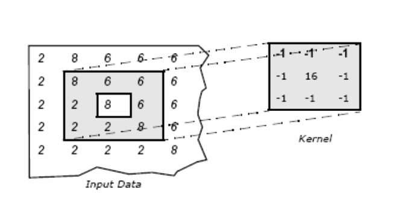

# Convolutional Automata

## Intro

TBD

## Background

TBD

### Premises

1. [Gilpin](#bib-1) has demonstrated that CAs can be represented as convolutional neural networks (CNNs) and their respective transition functions learned using a single 3x3 convlutional layer.

2. CAs can be evolved using specific aesthetic objective functions, as [Heaton](#bib-2) demonstrated with the _MergeLife_ algorithm, and simple genotype representations can be used to encode all the hyper parameters of a paritcular CA.

3. According to [Rafler](#bib-3) Conway's Game of Life can be generalized into the continous domain and the notion of "neighborhood" further generalized into a specific class of radial functions.

4. Wolfram's Elementary Automata taxonomies, definitions, etc. describe the primitives of cellular automata.

## Generalizing 1-D Automata Using Convolutions

Assuming all of the above premises, we can begin to generalize 1-D automata as a two part construction of a convolutional _kernel function_ and _activation function_. Using these two classes of functions the _elementary automata_ described by [Wolfram](#bib-4) can be expressed as _elemenatary convolutional automata_, which will be referred to as _ECA_ or _ECAs_ from this point forward. But first, let's describe what these classes of function are.

### 2-D Kernel Function for Images

The _kernel_ function of our generalized ECA can be thought of as the operation of analyzing the local neighborhood of a cell in a single operation.

The history of this technique comes from [Fukushima](http://www.scholarpedia.org/article/Neocognitron)'s Neurocognitron and made its way into image processing. Using the kernel function technique that a single, computationally inexpensive operation can be applied over each pixel to create a transformation of the image. This includes transformations such as _blurring_ or _edge detection_.

In the 2-D case, it has be generally expressed by [Jaimie Ludwig](http://web.pdx.edu/~jduh/courses/Archive/geog481w07/Students/Ludwig_ImageConvolution.pdf) ( or [2](<https://en.wikipedia.org/wiki/Kernel_(image_processing)>) ) as:

```math
g(x, y) = \omega * f(x,y) = \sum_{s=-a}^{a} \sum_{t=-b}^{b} \omega(s, t) f(x - s, y - t)
```

Where $g(x,y)$ is is the filtered image $f(x,y)$ is the original image and every element is considered $-a \leq s \leq a$ and $-b \leq t \leq b$.

These take the form of matrix-like objects such as this one representing a 3x3 Gaussian blur effect on an image, where $c$ is some constant coefficient:

```math
\omega =
c

\begin{bmatrix}
1 & 2  & 1 \\
2 & 4 & 2 \\
1 & 2 & 1 \\
\end{bmatrix}

```

This type of function could then be applied over an image as follows:



### 1-D Kernel Functions for Sequences

These image kernel functions can just as easily be expressed in 1-D as follows:

```math
g(x) = \omega' * f(x) = \sum_{s=-a}^{a} \omega(s) f(x - s)
```

Using our Gaussian filter example, this creates the following $\omega'$

```math
\omega' =
\sqrt{c}
\begin{bmatrix}
1 & 2  & 1 \\
\end{bmatrix}
```

This could be applied over a list of pixel-like values or cells consisting of a single dimension just as easily as 2-D. For example, given the following convolution:

```math
\phi =
\begin{bmatrix}
2 & 1  & 2 \\
\end{bmatrix}
```

And the following sequence $s_0$:

```math
s_0 =
\begin{bmatrix}
0 & 4  & 1 & 0 & 0 & 3 \\
\end{bmatrix}
```

We can apply our convolution $\phi$ to generate $s_1$ as follows:

```math
s_1 =
\begin{bmatrix}
8 & 6 & 9 & 2 & 6 & 3 \\
\end{bmatrix}
```

_NOTE: this assumes $0$ at boundary conditions._

This process can also be repeated over and over to produce a never ending series of transformations over the original sequence $s_0$.

```math
s_2 =
\begin{bmatrix}
8 & 6 & 9 & 2 & 6 & 3 \\
\end{bmatrix}
```

```math
s_3 =
\begin{bmatrix}
20 & 40 & 25 & 32 & 16 & 15 \\
\end{bmatrix}
```

```math
s_4 =
\begin{bmatrix}
100 & 130 & 169 & 114 & 110 & 47 \\
\end{bmatrix}
```

More generally, this can be expressed as the following recurrence relation:

```math

s_n = \phi(s_{n-1})

```

However, given this is an additive convolution, you can see the side-effect of an ever-increasing values of each element in the sequence. To fully express the more dynamic behaviors of CAs, we need to add the _activation function_

## Activation Function

## Bib

TBD
